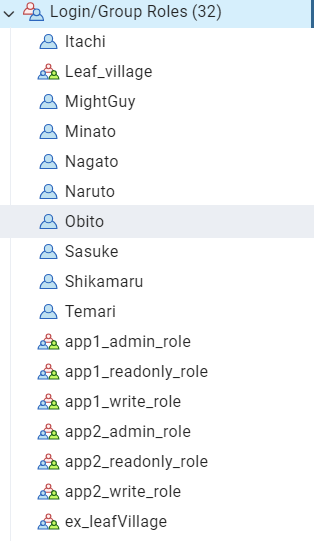
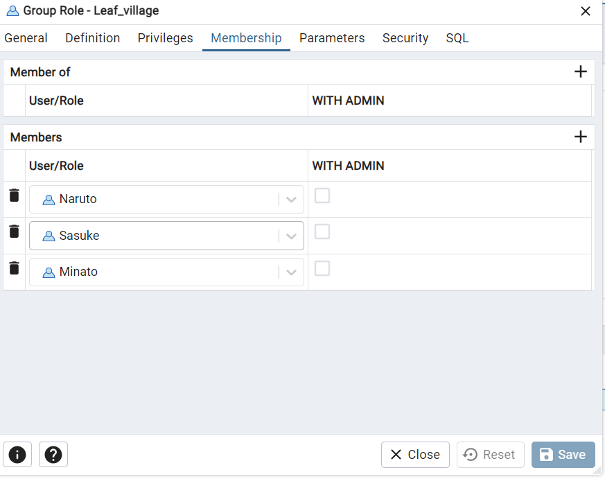

IAC -PostgreSQL project:

The objective of this project is to create Infrastructure of a PostgreSQL database with DB groups , DB roles , create schemas, and grant the necessary privileges to the roles to access the database for Dev, Staging and Production environments respectively.

How to Use the Script?
1) first change your directory to your desired environment
   
        Cd ./env/dev

        cd ./env/staging

        cd ./env/Prod

2) once inside your desired directory run the following commands to execute the scripts
            
            
            terraform init    -   Initializes the working directory containing configuration files and installs plugins for required providers.

            terraform plan -var-file "../global.tfvars"    -       creates an execution plan, which lets you preview the changes that Terraform plans to make to your infrastructure.

            terraform apply   -var-file "../global.tfvars"    -    command executes the actions proposed in a Terraform plan to create, update, or destroy infrastructure.

3) After running terraform apply command it will provide with all the changes to be made , Please review the changes before approving the changes.
       

Modules in the project :

In this project we are using modules to configure and apply each individual aspects involved in a database like creating roles , creating groups , creating Databases etc.

The modules in the project are as follows:

1) Create_Users :  Creates user on the database server which can connect with the database applications created.

Adds created users to their specified groups while role creation by checking if the user is part of any group.

2) Create_groups : create groups which consists of multiple users associated under a specific group.

        
        3) Create_schmea
        4) Create_database
        5) Grant_priviliges

        These modules are referenced in main.tf file in each environment by calling modules.

global.tfVars 

This terraform vars file contains all the data related to the variables which could  be used in creation of a PostgreSQL.

